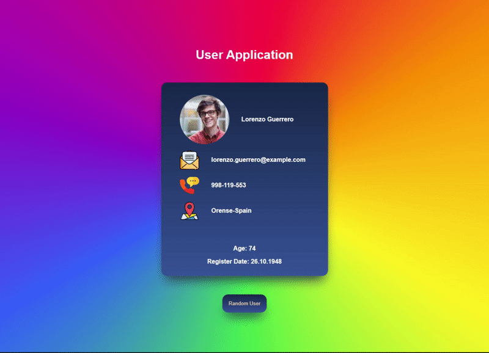

# Random User App

## Table of contents

- [Random User App](#random-user-app)
  - [Table of contents](#table-of-contents)
  - [Overview](#overview)
    - [Description](#description)
    - [Project Skeleton](#project-skeleton)
    - [Screenshot](#screenshot)
    - [Links](#links)
    - [Built with](#built-with)

## Overview

### Description

The project creates an information card by retrieving user information from the random user app

### Project Skeleton

```
random-user-app (folder)
       public(folder)
           |----index.html
       src (folder)
           |----app.js
           |----app.css
           |----index.js
           |----index.css
           components (folder)
                |----UserCard.css
                |----UserCard.jsx
           assets (folder)
                |----email.svg
                |----location.svg
                |----phone.svg
```

### Screenshot

<p align="center">
<a href="https://mfurkan40.github.io/React-Random-User"></a>
</p>

### Links

- Live: [Website Link](https://mfurkan40.github.io/React-Random-User)

### Built with

- REACT.JS
- JAVASCRİPT
- HTML5
- CSS3
